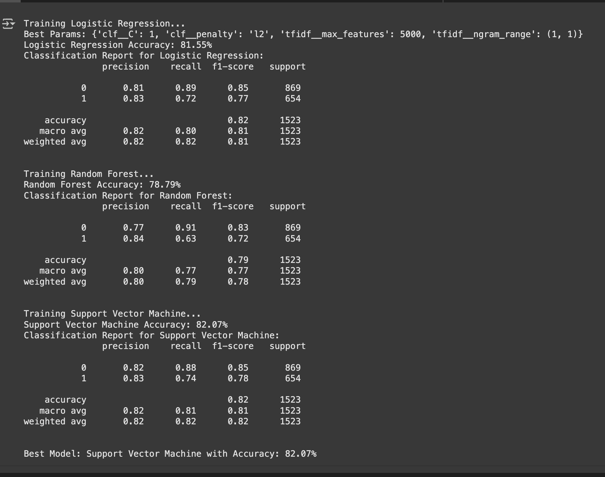
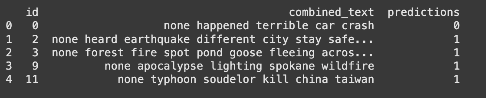
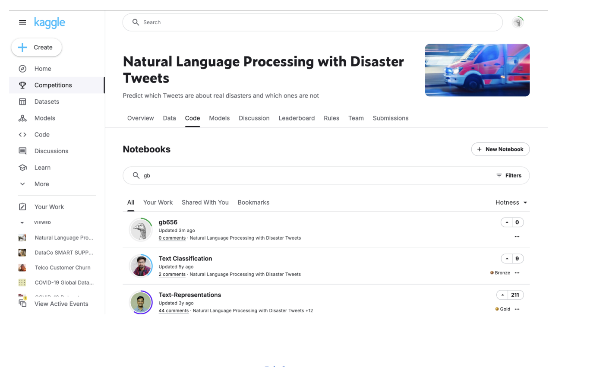

# Machine Learning: Disaster Tweet Classification (Kaggle Competition)

This project focuses on building a supervised machine learning model to classify tweets as real disaster-related or not. The task was based on a **Kaggle competition**, framed as a real-world business problem where disaster response teams need to detect and respond to true emergencies quickly.

---

## 🧠 Business Problem & Use Case

Social media is a critical channel for real-time information during disasters. However, it’s filled with irrelevant, ambiguous, or misleading posts. Automatically identifying **disaster-relevant tweets** can help:

- Emergency response teams prioritize alerts
- News agencies filter false positives
- Aid organizations assess real-time sentiment

A high-performing classifier can **accelerate crisis response**, improve **resource allocation**, and reduce **manual filtering overhead**.

---

## 🛠️ Tools Used

- **Python** (pandas, scikit-learn, matplotlib)
- **Google Colab** – for collaborative development and model training
- **Kaggle** – competition platform and data source

---

## 🧑‍💻 My Role

I contributed to **model performance comparison** and **report creation**. Specifically:

- Compared multiple models (Logistic Regression, Random Forest, Support Vector Machines)  
- Evaluated performance using accuracy, precision, recall, and AUC  
- Prepared final Kaggle submission  
- Wrote the analytical portion of the final report

---

## 🧪 Approach & Methodology

1. **Exploratory Data Analysis (EDA)**  
   - Word clouds, length analysis, and distribution checks.

2. **Text Preprocessing**  
   - Lowercasing, punctuation removal, stemming.

3. **Feature Engineering**  
   - TF-IDF vectorization for text representation.

4. **Model Training & Tuning**  
   - Trained Logistic Regression, Random Forest, and SVM.
   - Fine-tuned hyperparameters using GridSearchCV.

5. **Evaluation & Submission**  
   - Final model selected based on validation accuracy and Kaggle leaderboard performance.

---

## 📊 Visual Insights

### 🔹 Model Performance Comparison  

We tested **Logistic Regression**, **Random Forest**, and **SVM** classifiers. Logistic Regression delivered the best accuracy at **80.11%**, balancing precision and recall effectively.

---

### 🔹 Sample Predictions  

The trained model successfully identified disaster-related tweets, enabling faster prioritization by emergency services.

---

### 🔹 Kaggle Submission Snapshot  

We participated in the official [Kaggle Disaster Tweets competition](https://www.kaggle.com/code/aryanlakhani/gb656), submitting our results and benchmarking them against other solutions.

---

## 📁 Files Included

| File | Description |
|------|-------------|
| `FinalProjectGB656_Project.ipynb` | Python notebook with all code and analysis |
| `train.csv`, `test.csv`, `sample_submission.csv` | Dataset files |
| `Report.pdf` | Final written report (5 pages) |
| `*.png` | Visuals for Kaggle score, model comparison, and predictions |

---

## ✅ Key Learning Outcomes

- Applied **text classification techniques** in a practical business scenario  
- Compared classical ML models on a real-world dataset  
- Improved understanding of preprocessing, vectorization, and model tuning  
- Practiced communicating technical results in a professional report

---

## 📬 Let’s Connect!

If you're working on something exciting in machine learning, NLP, or real-time classification — I’d love to chat!

📧 [Email me](mailto:arma.rahamath@gmail.com)  
🔗 [LinkedIn](https://www.linkedin.com/in/armashaik/)  
💻 [More Projects](https://github.com/ArmaShaik)

---
